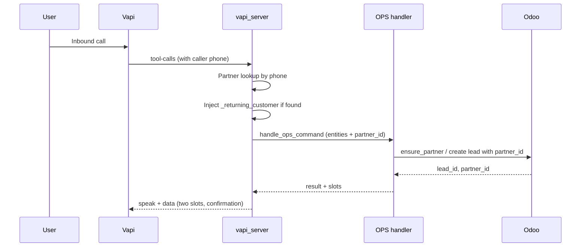

# Client Requested Changes — Implementation Plan

**Scope:** All items in [doc/HAES_Requested_Changes_Client_Review.md](doc/HAES_Requested_Changes_Client_Review.md) **except** #3 (Automatic Callback), #5 (Photo via SMS), #15 (Multiple Work Orders), #18 (Spanish).

**Prompt/KB rule:** When editing [doc/vapi/system_prompt_customer_inbound.md](doc/vapi/system_prompt_customer_inbound.md) or [doc/vapi/kb/](doc/vapi/kb/), follow [skills/PromptEngineeringSkills.md](skills/PromptEngineeringSkills.md): critical rules in prompt only; procedures, question sets, and checklists in KB; one short prompt line per new behavior where possible.

---

## Vapi built-in variables (no backend needed)

Vapi provides these automatically for use in **prompts** and **tool parameter templates** (Liquid). No backend code is required to expose them.

| Variable                      | Description                                                              |
| ----------------------------- | ------------------------------------------------------------------------ |
| `{{call.id}}`                 | Unique call ID                                                           |
| `{{call.customer.number}}`    | Customer's phone number (caller ID)                                      |
| `{{call.customer.name}}`      | Customer's name (if set)                                                 |
| `{{call.phoneNumber.number}}` | Your Vapi phone number they called                                       |
| `{{call.type}}`               | inboundPhoneCall, outboundPhoneCall, webCall                             |
| `{{call.startedAt}}`          | Call start timestamp                                                     |
| `{{call.status}}`             | Current call status                                                      |
| `{{assistant.name}}`          | Assistant name (e.g. Riley)                                              |
| `{{assistant.id}}`            | Assistant ID                                                             |
| `{{now}}`                     | Current timestamp (business hours still need a tool for time zone logic) |

**Transcript in tools:** During the tool-calls webhook, the backend receives the full conversation transcript and all previous messages (user + assistant) in the payload.

**Pro tip:** Use `{{call.customer.number}}` (or other variables) **directly in tool parameter definitions** in Vapi so the value is sent to the backend automatically. The webhook payload already includes full call context (e.g. caller number), so the backend has access without the model having to “pass” it explicitly.

**What still needs backend/Odoo:** Customer lookup by phone (Vapi doesn’t know your customers), appointment history, account balance/billing, service request creation, and any photo/attachment handling — all require your backend and Odoo.

---

## Phase 1: Config and quick wins (no backend logic)

### 1. Ring delay (2–3 seconds before bot answers) — #1

- **Where:** Vapi Phone Number Hooks (dashboard or API). No app code change in this repo.
- **How:** Configure a **call.ringing** hook on the phone number; use a **say** action with silence/pause (2–3 sec) and `blocking: true` so the call rings before the bot answers. Alternatively, set at telephony provider (Twilio/Vonage) if the number is imported.
- **Where to configure:** Vapi dashboard → Phone Number → Hooks → call.ringing.

### 2. Call purpose identification at start — #17

- **Prompt (minimal):** Add one short instruction after the greeting: “After the greeting, ask: ‘Are you calling for: (1) Service or repair, (2) Equipment replacement, (3) Scheduled maintenance, or (4) A question I can answer?’ Route to the matching workflow.”
- **KB:** Add a short “Call purpose routing” section in [doc/vapi/kb/customer_faq.txt](doc/vapi/kb/customer_faq.txt) (or a small procedures file) with the exact phrasing and which tool/workflow each option maps to, so the model can follow it via search.

### 3. Enhanced warranty question — #19

- **Prompt (minimal):** Replace any “Have you called us before?” with: “Ask: ‘Have we provided service or warranty work at your house before?’” (Single line; no long copy in prompt.)

### 4. Information confirmation before finalizing — #8

- **Prompt (minimal):** Add one rule: “Before completing an appointment, repeat back: name, address, phone, service type, problem description, and scheduled date/time. Ask: ‘Is all of this correct?’ Only finalize after confirmation.”
- **KB:** Optional short “Pre-finalize confirmation” procedure (exact fields and sample script) so the model can retrieve it.

---

## Phase 2: Two time slots (#6) — backend + prompt

**Goal:** Offer exactly two available slots (e.g. “Tuesday 10 AM or Wednesday 2 PM”) and let the customer choose.

- **Scheduling layer:** Add a function that returns **two** distinct slots (e.g. `find_next_two_available_slots` in [src/brains/ops/scheduling_rules.py](src/brains/ops/scheduling_rules.py) or [src/integrations/odoo_appointments.py](src/integrations/odoo_appointments.py)): first slot via existing `get_next_available_slot(after, ...)`; second via `get_next_available_slot(first_slot.end + buffer, ...)`.
- **OPS handler:** In [src/brains/ops/handlers.py](src/brains/ops/handlers.py), in `_handle_schedule_appointment` (and any availability-check path that returns “next slot”):
  - Call the new “two slots” API.
  - Return both slots in the result (e.g. `next_available_slots: [slot1, slot2]`) and a message that presents both (e.g. “I have [Slot A] or [Slot B]. Which works better?”).
- **Direct tool:** [src/vapi/tools/ops/schedule_appointment.py](src/vapi/tools/schedule_appointment.py) and [src/vapi/tools/ops/check_availability.py](src/vapi/tools/check_availability.py) already call the OPS handler; they will automatically surface the two-slot response once the handler returns two slots. Ensure the tool response includes both options in `speak` or `data` so the assistant can read them out.
- **Prompt (minimal):** Add one line: “When scheduling, offer exactly two time slot options and ask which works better. Do not offer a single slot.”

---

## Phase 3: Lead source tracking (#7) — backend + prompt/KB

**Goal:** Before finalizing, ask “How did you hear about us?” and tag the lead in Odoo.

- **Odoo/lead service:** [src/integrations/odoo_leads.py](src/integrations/odoo_leads.py) already has `ensure_lead_source(source_name)` and sets `source_id` on the lead (around 731–751). Extend so that when `structured_params` contains a key such as `lead_source` (e.g. “Google”, “Referral”, “Social media”, “Previous customer”, “Other”), use that as `source_name` for `ensure_lead_source` instead of the default “AI Voice Agent”. Normalize a small set of labels (e.g. map “social” → “Social media”) so Odoo has consistent utm.source names.
- **Where leads are created:** Ensure every path that creates/updates a lead from voice (e.g. [src/api/vapi_server.py](src/api/vapi_server.py) lead upsert after tool success, and any direct tool that creates a lead) can receive and pass `lead_source` (e.g. from tool parameters or from a dedicated “set_lead_source” or “finalize_call” payload). If the assistant collects “how did you hear about us?” in one of the last tool calls before end-of-call, that tool’s parameters must include something like `lead_source` and be passed into `structured_params` when calling `upsert_service_lead` / equivalent.
- **Prompt (minimal):** “Before finalizing the call, ask: ‘How did you hear about us?’ and pass the answer into the lead (use the tool parameter for lead source).”
- **KB:** Short list of accepted lead source options (Google, Referral, Social media, Previous customer, Other) so the model can normalize answers.

---

## Phase 4: SMS and email confirmations after call (#9)

**Goal:** Right after an appointment is scheduled, send both SMS and email to the customer with appointment details (date, time, service type, confirmation/reference).

- **Current state:** [src/brains/ops/handlers.py](src/brains/ops/handlers.py) sends SMS/email for **reschedule** (e.g. around 921–968) and schedules a **reminder** SMS for new appointments in [src/vapi/tools/ops/schedule_appointment.py](src/vapi/tools/ops/schedule_appointment.py) (around 169–226). It does **not** send an immediate “appointment confirmed” SMS and email when a **new** appointment is created.
- **Change:** After a successful new appointment creation in the schedule flow (either in the OPS handler or in the schedule_appointment tool after `handle_ops_command` returns success):
  - Send one SMS to the customer with: date, time, service type, and confirmation/reference (e.g. appointment ID or “Confirmation #…”).
  - Send one email to the customer with the same details (reuse or mirror the pattern used for reschedule confirmation email).
- **Implementation options:** (A) Add the send in [src/vapi/tools/ops/schedule_appointment.py](src/vapi/tools/ops/schedule_appointment.py) after a successful result (same place reminder is scheduled), reusing existing Twilio and email services; or (B) Add it in [src/brains/ops/handlers.py](src/brains/ops/handlers.py) inside `_handle_schedule_appointment` when `event_id` is set. Prefer (A) if the tool has access to phone/email and result payload; otherwise (B). Use the same “confirmation” wording and format as reschedule for consistency.

---

## Phase 5: Returning customer recognition (#4) and profile lookup (#20)

**Goal:** (1) Detect returning customer by phone at call start and greet by name; use existing profile. (2) When the customer says “yes” to the warranty/service history question, look up by phone + address, confirm “I found your profile, [Name] at [Address], is that correct?” and create the new work order under that existing customer (no new `res.partner`).

**Customer phone number (caller ID) from Vapi:**

- Vapi provides the **customer phone number** (caller ID) during the call (see **Vapi built-in variables** above). Use it for returning-customer lookup.
- **In the system prompt:** Reference the customer number with **Liquid**: `{{call.customer.number}}`. Vapi injects the actual number when the call starts. You can also use `{{call.customer.number}}` in tool parameter templates so the backend receives it without the model passing it manually; the tool-calls webhook payload already includes full call context (caller number).
- **Add a “Customer Context” block to Riley’s system prompt** (minimal), for example:
  - “## Customer Context — The caller’s phone number is {{call.customer.number}}. When the call starts, use this number to look up their account (via the customer lookup tool). If they are an existing customer, greet them by name and use their existing profile; do not ask for name/address again unless confirming.”

**Backend lookup (optional parallel path):**

- [src/api/vapi_server.py](src/api/vapi_server.py) already extracts `caller_phone` from the Vapi message for internal OPS. For the **customer** line, you can add a parallel step: when processing an inbound customer call, search Odoo `res.partner` by that phone (same normalization as [src/integrations/odoo_leads.py](src/integrations/odoo_leads.py) `ensure_partner`). If exactly one partner is found, attach to the request context (e.g. `parameters["_returning_customer"] = {"name": "...", "partner_id": ..., "address": "..."}`) so tools receive it without the model having to call a lookup tool first.
- **Prompt (minimal):** “If caller context includes a returning customer name, greet by name and use the existing profile; do not ask for name/address again unless confirming.”
- **Tools:** When creating a lead or appointment, if `_returning_customer.partner_id` is present, pass it into the lead/appointment creation so that [LeadService.ensure_partner](src/integrations/odoo_leads.py) (or the appointment service) uses that `partner_id` instead of creating a new partner. In [src/integrations/odoo_leads.py](src/integrations/odoo_leads.py), extend `ensure_partner` (or add an overload) to accept an optional `existing_partner_id`; when provided, skip search/create and return that ID so the lead is linked to the existing customer.

**Warranty “yes” → lookup by phone + address and confirm:**

- **Flow:** When the customer says “yes” to “Have we provided service or warranty work at your house before?”, the assistant must have already collected phone and address (or collect them next). Then:
  - Backend: A small helper or tool that accepts phone + address, searches `res.partner` (phone/mobile + address normalization), returns at most one match with name and address for confirmation.
  - The assistant says: “I found your profile, [Name] at [Address]. Is that correct?” If the customer confirms, the same `partner_id` is used for all subsequent lead/appointment creation (as above).
- **Implementation:** Either (1) a new Vapi tool `lookup_customer_profile` that takes phone and address and returns `{ found: true, name, address, partner_id }` or “not found,” or (2) the same “returning customer” context populated when phone+address are available (e.g. after collect). Option (1) is clearer for the assistant to invoke after “yes” and avoids reusing only call-start phone. Prefer (1) and keep prompt minimal: “When customer says yes to warranty/service history, call the customer profile lookup tool with their phone and address; if a profile is found, confirm name and address and then use that profile for the rest of the call.”

---

## Phase 6: Enhanced diagnostic questions (#2) and maintenance assessment (#10)

**Principle:** Long question sets live in KB; prompt only says when to use them.

- **KB:** Add structured sections in [doc/vapi/kb/customer_faq.txt](doc/vapi/kb/customer_faq.txt) (or a dedicated intake file, e.g. `doc/vapi/kb/intake_diagnostic_questions.txt`):
  - **#2 — Diagnostic questions:** By category: water leaks (location, inside/outside unit, where they see water); unit not working (inside/outside unit, when noticed, how long in house); cooling/heating (noise, when noticed, happened before); appliance (electric/gas, appliance type). One short bullet per question so the model can search and ask.
  - **#10 — Maintenance assessment:** The six questions (operation, hot/cold spots, high bills, sticky/dry, allergies/sickness, dust) plus the bonus air filter size question. Again, bullets in KB.
- **Prompt (minimal):** “For service/repair calls, after intent, use the knowledge base to ask the relevant diagnostic questions by issue type (water leak, unit not working, cooling/heating, appliance). For maintenance calls, use the knowledge base to run the six-question maintenance assessment and optional air filter size.”
- **Storing answers:** If desired, extend tool parameters (e.g. `create_service_request` or schedule tool) to accept optional structured fields such as `diagnostic_answers` or `maintenance_answers` (e.g. a JSON string or key-value list) and write them into the lead description or a custom field in Odoo so technicians see them. This is optional for Phase 6; the minimum is KB + prompt so the assistant asks the questions; storage can follow in a later step.

---

## Phase 7: Tenant vs property management (#11, #12)

**Goal:** At start, ask “Are you calling as a tenant or as part of the property management team?” Then: PM = streamlined, can schedule multiple properties; Tenant = standard workflow, tenant details collected, PM notified. Both get two time slots; notification differs (tenant call → notify tenant + PM; PM call → notify PM only).

- **Prompt (minimal):** “At the beginning of the call, ask: ‘Are you calling as a tenant or as part of the property management team?’ If property management: use streamlined scheduling and allow multiple properties; if tenant: collect tenant details and ensure property management is notified. Both receive two time slot options.”
- **KB:** Add a short “Property management vs tenant” procedure: workflow differences, what to collect for each, and who gets notified.
- **Backend:** [src/integrations/odoo_leads.py](src/integrations/odoo_leads.py) already supports `property_type` “property_management” and tenant/PM logic (e.g. around 769–816). Ensure the **caller_type** (tenant vs PM) is passed from the assistant (e.g. as a parameter or in `structured_params`, e.g. `caller_type: "tenant" | "property_management"`). Use it to:
  - Set tags/description so the lead is clearly tenant vs PM.
  - Drive notification logic: when sending post-appointment SMS/email (Phase 4), if caller is tenant, send to tenant and add PM to notification list; if caller is PM, send only to PM. Notification recipients may be stored on the lead (e.g. PM email/phone) or in existing DISPATCH_EMAIL / similar; clarify where PM contact is stored and add tenant contact to the notification list for tenant-originated calls.

---

## Phase 8: Commercial — urgency (#13), property-type questions (#14), checklist (#16)

**Principle:** Again, minimal prompt; full question sets and checklist in KB.

- **#13 — Urgency:** One prompt line: “At the start of commercial calls, ask: ‘Is this an urgent issue requiring immediate attention, or can it be scheduled at your convenience?’ Set priority and timeline accordingly.” Pass urgency into existing lead/request (e.g. existing urgency or priority fields).
- **#14 — Property-type questions (hotels, warehouses, schools):** Add a KB section (e.g. in [doc/vapi/kb/customer_faq.txt](doc/vapi/kb/customer_faq.txt) or a commercial intake file) with the exact question sets for hotels (rooms, ladder, check-in, guests), warehouses (ladder, height, equipment type, count, operations/safety), schools (ladder, system type, areas, time, security). Prompt: “For commercial calls, after urgency, determine property type (hotel, warehouse, school, etc.) and use the knowledge base to ask the property-type-specific questions.”
- **#16 — Commercial checklist:** Same KB document: list of required data (urgency, property type, ladder access and location, equipment type and quantity, point of contact, access restrictions, business hours, safety). Prompt: “For every commercial call, ensure all commercial checklist items are collected; use the knowledge base for the full checklist.” Ensure lead creation accepts these (e.g. in description or structured_params) so they are stored on the lead for technicians.

**Data flow (high level):**

---

## Implementation order (suggested)

1. **Phase 1** — Config + prompt/KB for #1, #17, #19, #8 (no backend).
2. **Phase 2** — Two slots (#6): scheduling + handler + prompt.
3. **Phase 3** — Lead source (#7): odoo_leads + structured_params + prompt/KB.
4. **Phase 4** — Post-appointment SMS + email (#9).
5. **Phase 5** — Returning customer (#4, #20): partner lookup at start + optional `lookup_customer_profile` tool + ensure_partner(partner_id) + prompt.
6. **Phase 6** — Diagnostic and maintenance questions (#2, #10): KB + prompt; optional tool/param for storing answers.
7. **Phase 7** — Tenant vs PM (#11, #12): prompt + KB + caller_type in structured_params + notification logic.
8. **Phase 8** — Commercial (#13, #14, #16): prompt + KB + urgency/checklist in lead.

---

## Post-implementation: Script to update Vapi assistant (prompt + tool descriptions)

After making prompt and KB changes, a script should **update the existing Vapi assistant** (no create) so the live assistant uses the new system prompt and tool descriptions from the repo.

**Requirements:**

- **Config:** Use [src/config/settings.py](src/config/settings.py) via `get_settings()`. Read `VAPI_ASSISTANT_ID` and `VAPI_API_KEY` (and optionally `VAPI_WEBHOOK_SECRET` for `serverUrlSecret`) from settings. Do not rely only on env vars; load through the app config so it stays consistent with the rest of the codebase.
- **Prompt:** Read the system prompt from [doc/vapi/system_prompt_customer_inbound.md](doc/vapi/system_prompt_customer_inbound.md) and send it in the assistant PATCH as the system message (e.g. `model.messages[0].content` or the equivalent in Vapi’s PATCH body).
- **Tools:** Read all tool definition JSONs from [doc/vapi/tools/customer_facing/](doc/vapi/tools/customer_facing/) (e.g. `**/*.json`). For each JSON, build the tool payload expected by Vapi (function name, description, parameters, plus `server.url` pointing at your Server URL endpoint). Send the full list of tools in the PATCH so the assistant’s tools and their descriptions match the repo.
- **API:** PATCH the existing assistant by ID (`PATCH https://api.vapi.ai/assistant/{VAPI_ASSISTANT_ID}`). Do not create a new assistant; only update the one identified by `VAPI_ASSISTANT_ID`.
- **Output:** Log success or failure and, on failure, print the response body or error so the user can fix config or payload.

**Suggested location:** `scripts/update_vapi_assistant_from_repo.py` (or similar). Can be invoked after edits to the prompt or tool JSONs to push changes to Vapi without using the dashboard.

---

## Files to touch (summary)

| Area              | Files                                                                                                                                                                                                              |
| ----------------- | ------------------------------------------------------------------------------------------------------------------------------------------------------------------------------------------------------------------ |
| Prompt            | [doc/vapi/system_prompt_customer_inbound.md](doc/vapi/system_prompt_customer_inbound.md)                                                                                                                           |
| KB                | [doc/vapi/kb/customer_faq.txt](doc/vapi/kb/customer_faq.txt), optionally new `doc/vapi/kb/intake_diagnostic_questions.txt` and commercial intake                                                                   |
| Scheduling        | [src/brains/ops/scheduling_rules.py](src/brains/ops/scheduling_rules.py), [src/integrations/odoo_appointments.py](src/integrations/odoo_appointments.py), [src/brains/ops/handlers.py](src/brains/ops/handlers.py) |
| Lead/source       | [src/integrations/odoo_leads.py](src/integrations/odoo_leads.py)                                                                                                                                                   |
| Confirmations     | [src/vapi/tools/ops/schedule_appointment.py](src/vapi/tools/ops/schedule_appointment.py) and/or [src/brains/ops/handlers.py](src/brains/ops/handlers.py), Twilio + email services                                  |
| Caller context    | [src/api/vapi_server.py](src/api/vapi_server.py) (partner lookup, `_returning_customer`)                                                                                                                           |
| Optional new tool | New Vapi tool for customer profile lookup (phone + address → confirm profile)                                                                                                                                      |
| Ring delay config | Vapi dashboard (Phone Number Hooks) only; no repo file changes                                                                                                                                                     |
| Update script     | New script (e.g. `scripts/update_vapi_assistant_from_repo.py`) using `get_settings()` and PATCH assistant by `VAPI_ASSISTANT_ID` with prompt + tools from repo                                                     |

All prompt and KB edits must keep the system prompt minimal and push procedures/question sets into the KB per [skills/PromptEngineeringSkills.md](skills/PromptEngineeringSkills.md).