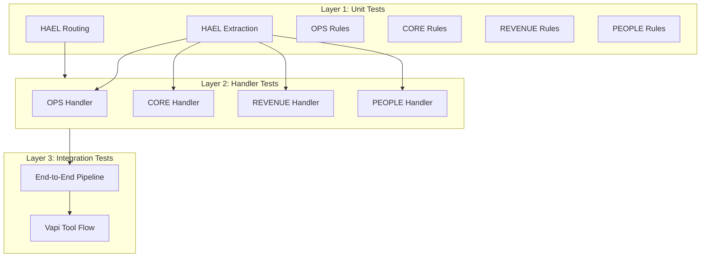

# Comprehensive Brain Testing Plan

## Test Architecture Overview



---

## 1. HAEL Extraction Tests (Expand Existing)

**File:** `tests/test_hael_extractor_comprehensive.py`

### 1.1 Intent Classification Matrix

Test EVERY intent with multiple phrasings:

| Intent | Test Cases |

|--------|------------|

| `SERVICE_REQUEST` | 15+ variations including "heater not heating", "service request", "need repair" |

| `SCHEDULE_APPOINTMENT` | Schedule, book, set up, arrange, next available |

| `RESCHEDULE_APPOINTMENT` | Reschedule, change time, move appointment |

| `CANCEL_APPOINTMENT` | Cancel, don't need, no longer need |

| `STATUS_UPDATE_REQUEST` | Where is technician, ETA, status of my |

| `QUOTE_REQUEST` | Quote, estimate, price, how much, new system |

| `BILLING_INQUIRY` | Bill, charge, balance, amount due |

| `PAYMENT_TERMS_INQUIRY` | Payment terms, financing, how to pay |

| `INVOICE_REQUEST` | Invoice, receipt, send invoice |

| `INVENTORY_INQUIRY` | Parts available, in stock |

| `PURCHASE_REQUEST` | Order parts, buy equipment |

| `HIRING_INQUIRY` | Are you hiring, job opening, careers |

| `ONBOARDING_INQUIRY` | Onboarding, first day, orientation |

| `PAYROLL_INQUIRY` | Paycheck, pay stub, commission |

### 1.2 Entity Extraction Edge Cases

- Phone: International formats (+1, +92, etc.), with extensions
- Email: Various domains, subdomains, plus addressing
- Address: Full addresses, partial, abbreviations (St, Ave, Blvd)
- ZIP: 5-digit, 9-digit, with dashes
- Square footage: Various formats (2500 sqft, 2,500 sq. ft., 2500 square feet)
- Temperature: Fahrenheit mentions, Celsius, "degrees", "°"

### 1.3 Urgency Classification

- Emergency keywords (gas, CO, fire, flooding, burning)
- Temperature-based emergencies (no heat + cold, no AC + hot)
- High urgency (today, ASAP, elderly, baby)
- Combination scenarios

---

## 2. HAEL Routing Tests

**File:** `tests/test_hael_routing_comprehensive.py`

### 2.1 Brain Routing Matrix

| Intent | Expected Brain | Missing Fields Triggers |

|--------|---------------|------------------------|

| `SERVICE_REQUEST` | OPS | identity, location, problem_description |

| `QUOTE_REQUEST` | REVENUE | identity, property_type, timeline |

| `BILLING_INQUIRY` | CORE | phone or email |

| `HIRING_INQUIRY` | PEOPLE | None (general info) |

### 2.2 Field Validation

- Test each required field missing individually
- Test multiple missing fields
- Test partial data (phone but no email, name but no phone)

### 2.3 Confidence Thresholds

- High confidence (> 0.7) routes directly
- Low confidence (< 0.5) triggers human review

---

## 3. OPS Brain Handler Tests

**File:** `tests/test_ops_handlers_comprehensive.py`

### 3.1 Service Request Handler

```
Test Matrix:
├── Valid request (all fields present)
│   ├── Emergency priority classification
│   ├── Urgent priority classification
│   ├── Normal priority classification
│   └── Technician assignment
├── Missing fields
│   ├── No identity → NEEDS_HUMAN
│   ├── No location → NEEDS_HUMAN
│   └── No problem description → NEEDS_HUMAN
├── Emergency qualification
│   ├── Gas leak → EMERGENCY
│   ├── CO alarm → EMERGENCY
│   ├── No heat + cold temp → EMERGENCY
│   ├── No AC + hot temp → EMERGENCY
│   └── Standard issue → NOT emergency
└── Service type inference
    ├── AC keywords → AC service
    ├── Heating keywords → Heating service
    └── Generic → General HVAC
```

### 3.2 Schedule/Reschedule/Cancel Handlers

- Identity required for all
- Success messages returned
- Status fields populated

### 3.3 Status Update Handler

- Identity required
- Lookup action returned

---

## 4. CORE Brain Handler Tests

**File:** `tests/test_core_handlers_comprehensive.py`

### 4.1 Billing Inquiry

- Requires identity (phone or email)
- Returns compliance disclosures
- Action = "lookup_billing"

### 4.2 Payment Terms Inquiry

- Residential vs commercial segments
- Default terms for unknown segment
- Payment terms text formatting

### 4.3 Invoice Request

- Requires identity
- Action = "send_invoice"

### 4.4 Inventory Inquiry

- No identity required (general info)

### 4.5 Purchase Request

- Requires identity

### 4.6 Pricing Engine Tests

- Tier pricing (Retail, Preferred, Commercial)
- Emergency premium
- After-hours premium
- Weekend premium
- Combined premiums

---

## 5. REVENUE Brain Handler Tests

**File:** `tests/test_revenue_handlers_comprehensive.py`

### 5.1 Quote Request Handler

```
Test Matrix:
├── Valid request
│   ├── HOT qualification (urgent + high budget)
│   ├── WARM qualification (moderate indicators)
│   └── COLD qualification (no urgency)
├── Missing required fields
│   ├── No identity → NEEDS_HUMAN
│   ├── No property_type → NEEDS_HUMAN
│   └── No timeline → NEEDS_HUMAN
├── Low confidence qualification
│   └── confidence < 0.6 → NEEDS_HUMAN
└── Lead routing
    ├── Residential → specific assignees
    └── Commercial → specific assignees
```

### 5.2 Follow-up Generation

- Follow-ups based on qualification level
- Email vs phone follow-ups
- Timing of follow-ups

---

## 6. PEOPLE Brain Handler Tests

**File:** `tests/test_people_handlers_comprehensive.py`

### 6.1 Hiring Inquiry

- No identity required
- Returns hiring requirements
- Interview stages, approvers

### 6.2 Onboarding Inquiry

- Requires employee email
- Returns checklist items
- Training program details

### 6.3 Payroll Inquiry

- Requires employee email
- Returns payroll summary
- Commission rules

---

## 7. End-to-End Integration Tests

**File:** `tests/test_e2e_brain_integration.py`

### 7.1 Full Pipeline Tests

Test complete flow: Raw text → HAEL extraction → Routing → Brain handler → Response

```python
# Example test structure
class TestE2EPipeline:
    def test_service_request_complete_flow(self):
        """Full flow: 'My heater is broken' with all context → OPS brain → work order"""
        
    def test_quote_request_complete_flow(self):
        """Full flow: 'Need quote for new AC' with context → REVENUE brain → lead"""
        
    def test_billing_inquiry_complete_flow(self):
        """Full flow: 'Question about my bill' → CORE brain → lookup"""
        
    def test_hiring_inquiry_complete_flow(self):
        """Full flow: 'Are you hiring?' → PEOPLE brain → info"""
```

### 7.2 Realistic Conversation Scenarios

Based on actual Vapi transcripts:

- Service request with progressive intake
- Quote with follow-up questions
- Billing with account lookup
- Status check with identity verification

---

## 8. Vapi Tool Call Integration Tests

**File:** `tests/test_vapi_tool_integration.py`

### 8.1 Tool Call Formats

- `toolCallList` format
- `toolWithToolCallList` format
- Both `parameters` and `arguments` fields
- `toolCall.function.parameters` nested format

### 8.2 Context Merging

- `user_text` only
- `user_text` + `conversation_context`
- Context with name, phone, address extraction

### 8.3 Response Format Validation

- `speak` field present
- `action` field valid (completed, needs_human, error)
- `data` structure correct
- `request_id` present

---

## 9. Edge Cases and Error Handling

**File:** `tests/test_edge_cases.py`

### 9.1 Input Edge Cases

- Empty string input
- Very long input (> 10000 chars)
- Unicode characters
- Special characters
- HTML/script injection attempts
- Multiple intents in one message

### 9.2 Missing/Malformed Data

- Empty entities
- Null values
- Invalid phone formats
- Invalid email formats

### 9.3 Concurrent Requests

- Idempotency key handling
- Race conditions

---

## 10. Test Fixtures

**File:** `tests/fixtures/brain_test_samples.json`

Create comprehensive fixture file with:

- 50+ service request variations
- 30+ quote request variations
- 20+ billing inquiry variations
- 15+ hiring inquiry variations
- 20+ edge case inputs

---

## Files to Create/Modify

| File | Action |

|------|--------|

| [`tests/test_hael_extractor_comprehensive.py`](tests/test_hael_extractor_comprehensive.py) | Create |

| [`tests/test_hael_routing_comprehensive.py`](tests/test_hael_routing_comprehensive.py) | Create |

| [`tests/test_ops_handlers_comprehensive.py`](tests/test_ops_handlers_comprehensive.py) | Create |

| [`tests/test_core_handlers_comprehensive.py`](tests/test_core_handlers_comprehensive.py) | Create |

| [`tests/test_revenue_handlers_comprehensive.py`](tests/test_revenue_handlers_comprehensive.py) | Create |

| [`tests/test_people_handlers_comprehensive.py`](tests/test_people_handlers_comprehensive.py) | Create |

| [`tests/test_e2e_brain_integration.py`](tests/test_e2e_brain_integration.py) | Create |

| [`tests/test_vapi_tool_integration.py`](tests/test_vapi_tool_integration.py) | Create |

| [`tests/test_edge_cases.py`](tests/test_edge_cases.py) | Create |

| [`tests/fixtures/brain_test_samples.json`](tests/fixtures/brain_test_samples.json) | Create |

---

## Test Execution Commands

```bash
# Run all comprehensive tests
pytest tests/ -v --tb=short

# Run specific brain tests
pytest tests/test_ops_handlers_comprehensive.py -v
pytest tests/test_core_handlers_comprehensive.py -v
pytest tests/test_revenue_handlers_comprehensive.py -v
pytest tests/test_people_handlers_comprehensive.py -v

# Run with coverage
pytest tests/ --cov=src/brains --cov=src/hael --cov-report=html

# Run only edge cases
pytest tests/test_edge_cases.py -v
```

---

## Success Criteria

- **100% intent coverage**: Every intent tested with 5+ variations
- **All handlers tested**: Every handler function has dedicated tests
- **Edge cases covered**: Empty, null, malformed, boundary inputs
- **Field validation**: Every required field validated
- **Emergency rules**: All emergency conditions tested
- **Pricing engine**: All premiums and tiers tested
- **E2E flows**: Complete pipeline from input to output