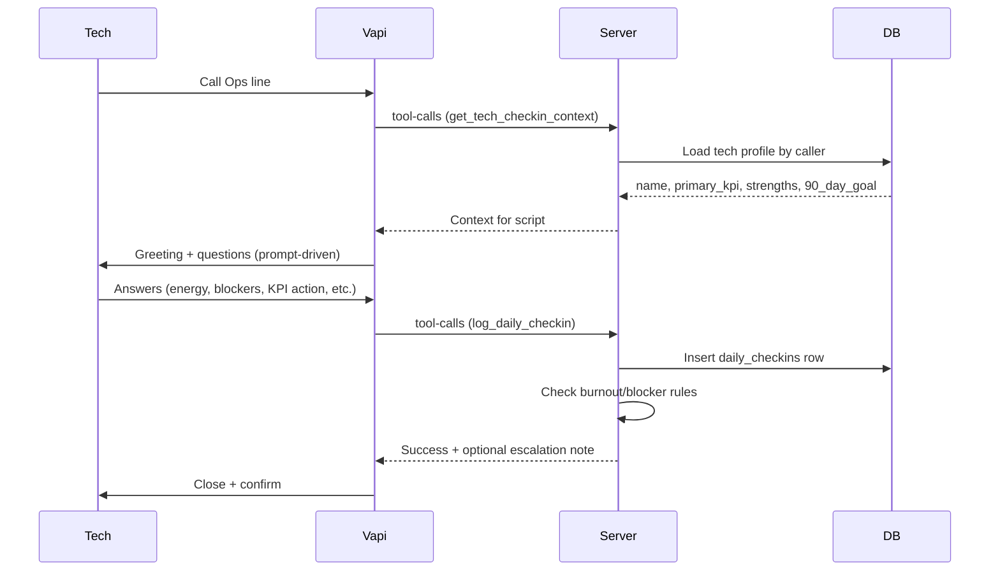
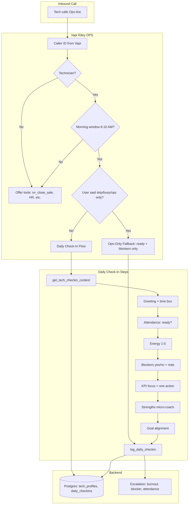

# Daily Ops Coach System — Implementation Plan

**How to use this plan:** (1) Confirm alignment with the client doc in **0a** and requirements in **0**. (2) Execute in order using the **Execution Todos** section — check off each item as you complete it. (3) Use **Section 8** for a phase summary and **Sections 5–7** for data model, tools, and prompt details. (4) Validate against **Success Criteria** at the end.

---

## 0a. Client Doc Alignment ([doc/client_shared/1 Daily ops coach_260124_044608 (1).txt](doc/client_shared/1 Daily ops coach_260124_044608 (1).txt))

The plan is **ready as per the client-shared doc**. Mapping:

| Client doc | Plan coverage |
|------------|----------------|
| **Objective:** Align WHY → mission, track KPIs, Gallup Strengths, detect burnout early, remove manager daily labor, compound growth | Section 1 goal; tech profiles (personal_why, primary_kpi, gallup_strengths); escalation (burnout/blocker); Phase 8 weekly loop. |
| **Reality:** 60–180 sec, supportive not surveillance, structured data, integrate later with HR/KPIs/reviews | 60–120 sec time box; prompt tone; Postgres schema; Phase 8 feeds manager/reviews. |
| **Tech Profile (static):** Name, Role, Start date, Gallup Top 5, Personal WHY, 90-day goal, Primary KPI (1–3) | tech_profiles: name, gallup_strengths, personal_why, current_90day_goal, primary_kpi; employee_id → Odoo (role/start date available there). Optional: add start_date to tech_profiles if desired. |
| **Daily Check-In (60–120 sec):** Human anchor → Health scan (energy 1–5, blockers) → KPI alignment → Strengths micro-coach → Micro-commitment | Section 7 full flow; Section 5.2 daily_checkins fields; 12 strength templates in prompt. |
| **Weekly Milestone Loop:** Progress vs goal %, KPI trend, time investment, burnout indicator; auto-flag manager on thresholds | Phase 8. |
| **Kill-switch / Ops-only:** "I'm busy", "skip", "not doing this", silence → two questions (ready? blockers?) → log | Section 7 kill-switch; call_type=ops_only. |
| **Script steps 1–8:** Greeting, attendance, energy, blockers, KPI focus, strengths, goal action, close + confirm | Section 7 full flow; exact client phrasing can be used in prompt. |
| **Strength templates (12):** Achiever, Responsibility, Competition, Learner, Relator, Communication, Analytical, Harmony, Discipline, Focus, Woo, Empathy | Section 7; same 12 in prompt. |
| **Data schema (minimum viable):** timestamp, tech_id, call_type, ready_status, not_ready_reason, energy_level, blocker_*, primary_kpi, kpi_action_today, coach_prompt_used, focus_summary_5_words, goal_action_today, call_completed, duration_seconds | Section 5.2 daily_checkins (employee_id = tech_id). |
| **Escalation:** not_ready (sick/family/other) → manager + dispatcher; energy ≤2 for 2+ days → burnout_watch; blocker note → ops | Section 5.3 + Phase 6: burnout and blocker covered; **attendance escalation** (not_ready_reason in sick/family/other → notify manager + dispatcher) added below. |
| **Failure mitigation:** Hard cap 2 min, Ops-only for resistance, "make it measurable" re-prompt, manager alert only on rules | Prompt: time box 90–120 sec; Ops-only; include re-prompt line in prompt; threshold-based escalation. |

**Gaps closed in this plan:** Attendance escalation rule (not_ready_reason in sick, family, other → notify manager + dispatcher) is now included in Section 5.3 and Phase 6.

---

## 0. Clear-Cut Points & Implementation Flow

**From:** [doc/client_shared/AGENT_STATUS_AND_NEW_REQUIREMENTS.md](doc/client_shared/AGENT_STATUS_AND_NEW_REQUIREMENTS.md) — Daily Ops Coach System.

### Requirements (what we deliver)

- **Purpose:** Morning check-in calls become coaching, accountability, and growth data.
- **Tech profiles:** Per technician — Gallup Strengths, 90-day goals, primary KPIs; stored in Postgres.
- **Daily check-in (60–120 sec):** Attendance → energy 1–5 → blockers → KPI focus → strengths micro-coaching → daily micro-commitment; all logged.
- **Weekly milestone loop:** Progress tracking, KPI trends, burnout detection (later phase).
- **Ops-only fallback:** If tech says skip/busy/ops only — ask ready + blockers only, then log; no full coaching script.
- **Structured logging:** Energy, blockers, KPIs, commitments in Postgres (same data as “to Odoo” requirement; Odoo not used for coach models).

### Implementation flow

1. **Data layer** — Add `tech_profiles` and `daily_checkins` tables, migration, CRUD helpers.
2. **Tech profile bootstrap** — Script/API to create/update profiles (Strengths, 90-day goal, primary KPI); link to Odoo employee.
3. **Tool: get_tech_checkin_context** — Returns name, primary_kpi, strengths, 90-day goal for caller; register and attach to Riley OPS.
4. **Tool: log_daily_checkin** — Persists one check-in (all fields + call_type); runs burnout/blocker/attendance escalation; register and attach.
5. **System prompt** — Daily Check-In script, when to run it, Ops-only kill-switch, 12 strength one-liners, when to use tools.
6. **Escalation** — Burnout (low energy 2+ workdays → manager); blocker note → ops; not_ready (sick/family/other) → manager + dispatcher.
7. **Testing and docs** — Manual full check-in and ops-only; update context.json and status doc.
8. **Weekly milestone loop** — Scheduled job: weekly summary per tech (progress, KPI trend, burnout flag); store/send; flag manager on thresholds.

---

## Execution Todos (check off as you go)

- [ ] **Phase 1 — Data layer**
  - [ ] Add `TechProfile` and `DailyCheckIn` models in [src/db/models.py](src/db/models.py).
  - [ ] Create Alembic migration for `tech_profiles` and `daily_checkins`.
  - [ ] Add CRUD helpers or service functions for profile lookup and check-in insert.
- [ ] **Phase 2 — Tech profile bootstrap**
  - [ ] Script or internal API to create/update tech profiles (employee_id, gallup_strengths, current_90day_goal, primary_kpi, personal_why).
  - [ ] Document mapping from Odoo hr.employee to tech_profiles.
- [ ] **Phase 3 — Tool: get_tech_checkin_context**
  - [ ] Implement handler in [src/vapi/tools/people/get_tech_checkin_context.py](src/vapi/tools/people/get_tech_checkin_context.py).
  - [ ] Register in [src/vapi/tools/register_tools.py](src/vapi/tools/register_tools.py) and add to `TOOL_PERMISSIONS` in [src/vapi/tools/base.py](src/vapi/tools/base.py).
  - [ ] Add Vapi JSON schema under [doc/vapi/tools/internal_ops/technician/](doc/vapi/tools/internal_ops/technician/) and attach tool to Riley OPS assistant.
- [ ] **Phase 4 — Tool: log_daily_checkin**
  - [ ] Implement handler in [src/vapi/tools/people/log_daily_checkin.py](src/vapi/tools/people/log_daily_checkin.py) (insert daily_checkins, run escalation rules).
  - [ ] Register, permissions, Vapi schema, attach to Riley OPS.
- [ ] **Phase 5 — System prompt**
  - [ ] Edit [doc/vapi/system_prompt_internal_ops.md](doc/vapi/system_prompt_internal_ops.md): add "Daily Check-In (Technicians, Morning)" section.
  - [ ] Include when to run (technician + morning / "check-in"), kill-switch phrases, full 8-step script, 12 strength templates, "make it measurable" re-prompt, 90–120 sec time box.
- [ ] **Phase 6 — Escalation wiring**
  - [ ] Burnout: on log_daily_checkin, if energy_level ≤ 2, check last 2 workdays; if both low → notify manager.
  - [ ] Blocker: if blocker_present + blocker_note → notify ops (email/SMS).
  - [ ] Attendance: if not_ready_reason in (sick, family, other) → notify manager + dispatcher.
- [ ] **Phase 7 — Testing and docs**
  - [ ] Manual test: full Daily Check-In flow → one row in daily_checkins with call_type=daily_checkin.
  - [ ] Manual test: say "skip" → Ops-only flow → one row with call_type=ops_only.
  - [ ] Update [.cursor/context.json](.cursor/context.json) and [doc/client_shared/AGENT_STATUS_AND_NEW_REQUIREMENTS.md](doc/client_shared/AGENT_STATUS_AND_NEW_REQUIREMENTS.md).
- [ ] **Phase 8 — Weekly Milestone Loop**
  - [ ] Scheduled job (e.g. weekly) that reads daily_checkins per employee for past week.
  - [ ] Compute: progress vs 90-day goal, KPI trend (up/flat/down), burnout indicator (energy ≤ 2 for 2+ days).
  - [ ] Store weekly summary and/or send to manager; auto-flag manager only when thresholds hit.

---

## 1. Goal and Scope

**Goal:** Turn the technician Ops line morning check-in into a short (60–120 sec) coaching flow that collects structured data (energy, blockers, KPI focus, micro-commitment) and stores it in Postgres, with optional strengths-based coaching and Ops-only fallback.

**In scope (this plan):**

- Tech profile storage (Gallup Strengths, 90-day goal, primary KPI) in Postgres
- Daily check-in flow: system prompt + 2 new tools
- Ops-only fallback (skip coaching, minimal Q&A)
- Structured logging to Postgres (energy, blockers, KPIs, commitments — requirement doc says Odoo; we use Postgres per feasibility)
- Burnout/blocker escalation rules (threshold-based)
- **Weekly Milestone Loop** (Phase 8): progress tracking, KPI trends, burnout detection — explicit later phase

**Out of scope (later / separate):**

- Manager dashboard for check-in data
- Job close-out and EOD close-out (AI-Integrated Workflow feature)

---

## 2. High-Level Workflow

**Flow summary:**

1. Technician calls Ops number; Vapi answers (Riley OPS).
2. **Call mode:** Prompt tells AI: if caller is technician and it’s morning (e.g. 6–10 AM local), run Daily Check-In; if tech says "skip" / "busy" / "ops only", use Ops-Only Fallback; else offer tools (ivr_close_sale, etc.).
3. **Daily Check-In path:** AI calls `get_tech_checkin_context` once; backend returns name, primary_kpi, strengths, 90_day_goal. AI runs script, then calls `log_daily_checkin` with collected answers.
4. **Backend:** `log_daily_checkin` writes one row to `daily_checkins`, optionally enqueues blocker/burnout notifications.
5. **Ops-Only path:** AI asks ready + blockers only, then calls `log_daily_checkin` with `call_type=ops_only`.

---

## 3. Flow Diagram — Call Routing and Check-In Steps

---

## 4. How This Uses the Current Implementation

| Current piece | How Daily Ops Coach uses it |
|---------------|-----------------------------|
| **Riley OPS** ([doc/vapi/system_prompt_internal_ops.md](doc/vapi/system_prompt_internal_ops.md)) | Extend with Daily Check-In script, when to run it, Ops-only fallback, and when to call the two new tools. |
| **Vapi Server URL** ([src/api/vapi_server.py](src/api/vapi_server.py)) | No change to routing; new tools registered like existing ones. Caller ID and RBAC already inject `_caller_id`, `_caller_role`. |
| **Caller ID** ([src/utils/caller_identification.py](src/utils/caller_identification.py)) | Use `employee_id` and role for technicians; look up tech profile and store on `daily_checkins`. |
| **RBAC** ([src/vapi/tools/base.py](src/vapi/tools/base.py)) | Add `get_tech_checkin_context` and `log_daily_checkin` to `TOOL_PERMISSIONS` (technician + manager/executive/admin). |
| **Postgres** ([src/db/](src/db/)) | New tables: `tech_profiles`, `daily_checkins`. New Alembic migration. |
| **Odoo** | Not used for coach data; optional link `tech_profiles.employee_id` to Odoo `hr.employee.id`. |

---

## 5. Data Model (Postgres)

**5.1 `tech_profiles`**

- `id` (PK), `employee_id` (int, unique), `name` (optional), `gallup_strengths` (JSONB array), `personal_why` (text), `current_90day_goal` (text), `primary_kpi` (string), `created_at`, `updated_at`.

**5.2 `daily_checkins`**

- `id`, `employee_id`, `call_id`, `call_type` (`daily_checkin` \| `ops_only`), `timestamp`, `ready_status`, `not_ready_reason` (e.g. sick, family, vehicle, schedule, other — used for attendance escalation), `energy_level` (1–5), `blocker_present`, `blocker_note`, `primary_kpi`, `kpi_action_today`, `coach_prompt_used`, `focus_summary_5_words`, `goal_action_today`, `call_completed`, `duration_seconds`. Index on `(employee_id, timestamp)`.

**5.3 Escalation**

- In `log_daily_checkin`: (1) If `energy_level <= 2`, query last 2 workdays for same `employee_id`; if both low, set burnout flag and enqueue notification to manager. (2) If blocker present + note, enqueue to ops (Slack/SMS/email). (3) If `not_ready_reason` in (sick, family, other), notify manager + dispatcher (per client doc).

---

## 6. New Tools (Riley OPS Only)

**6.1 `get_tech_checkin_context`** — Returns name, primary_kpi, top_strengths, 90_day_goal (and optional coaching_tip) for caller. Uses `_caller_id` / `_caller_phone`. Permissions: technician, manager, executive, admin.

**6.2 `log_daily_checkin`** — Persists one check-in; params: call_type, ready_status, not_ready_reason, energy_level, blocker_present, blocker_note, primary_kpi, kpi_action_today, coach_prompt_used, focus_summary_5_words, goal_action_today, call_completed, duration_seconds, call_id. Runs burnout and blocker escalation. Same permissions.

---

## 7. Riley OPS System Prompt Changes

**File:** [doc/vapi/system_prompt_internal_ops.md](doc/vapi/system_prompt_internal_ops.md)

Add section **"Daily Check-In (Technicians, Morning)"**:

- **When:** Caller is technician and morning (e.g. 6–10 AM) or says "check-in" / "morning check-in".
- **Kill-switch:** If tech says "skip", "busy", "ops only", "not doing this" → Ops-Only: ask only "Ready to roll? yes/no" and "Any blockers? yes/no — one sentence if yes." Then call `log_daily_checkin` with `call_type=ops_only`.
- **Full flow:** (1) Call `get_tech_checkin_context`. (2) Greeting + time box. (3) Attendance: ready? reason if no. (4) Energy 1–5. (5) Blockers yes/no + note. (6) KPI focus + one action. (7) Strengths micro-coach (one line from 12 templates) + "Repeat focus in five words or less." (8) Goal alignment: one action for 90-day goal. (9) Close. (10) Call `log_daily_checkin` with all fields, `call_type=daily_checkin`.
- Include 12 strength-based one-liners (Achiever, Responsibility, Competition, Learner, Relator, Communication, Analytical, Harmony, Discipline, Focus, Woo, Empathy) in the prompt.
- **When to run what:** If not morning or not technician → "What can I help you with?" and tool use.

---

## 8. Implementation Phases (Order of Work)

Work in order; track progress in **Execution Todos** above. Each phase has concrete deliverables.

| Phase | Summary | Key deliverables |
|-------|---------|-------------------|
| **1** | Data layer | TechProfile + DailyCheckIn models, Alembic migration, CRUD helpers |
| **2** | Tech profile bootstrap | Script/API to create/update profiles; doc Odoo hr.employee → tech_profiles mapping |
| **3** | get_tech_checkin_context | Handler (name, primary_kpi, strengths, 90_day_goal); register; TOOL_PERMISSIONS; Vapi schema; attach to Riley OPS |
| **4** | log_daily_checkin | Handler (insert daily_checkins, run escalation); register; schema; attach to Riley OPS |
| **5** | System prompt | Daily Check-In section in [doc/vapi/system_prompt_internal_ops.md](doc/vapi/system_prompt_internal_ops.md): when to run, kill-switch, 8-step script, 12 strength templates, time box 90–120 sec |
| **6** | Escalation wiring | Burnout (energy ≤2 for 2 workdays → manager); Blocker note → ops; not_ready (sick/family/other) → manager + dispatcher |
| **7** | Testing and docs | Manual full check-in + ops-only; update context.json and AGENT_STATUS_AND_NEW_REQUIREMENTS.md |
| **8** | Weekly Milestone Loop | Weekly job: read daily_checkins per tech; compute progress vs goal, KPI trend, burnout flag; store/send summary; flag manager on thresholds (e.g. [src/reporting/](src/reporting/) or new job type) |

---

## 9. Brainstorming: Alternatives and Decisions

| Decision | Option A | Option B | Choice |
|----------|----------|----------|--------|
| Where to store coach data | Postgres | Odoo | Postgres (Odoo custom models not creatable via API). |
| Data schema "to Odoo" (requirement) | Odoo | Postgres | Postgres; same structured data (energy, blockers, KPIs, commitments); requirement doc updated to note implementation choice. |
| Weekly Milestone Loop | In scope v1 | Later phase | Later phase (Phase 8) but explicitly in plan so requirement is covered. |
| Who drives the script | Prompt only | Prompt + 2 tools | Prompt + 2 tools. |
| Ops-only trigger | Prompt phrases | Tool param | Prompt detects "skip"/"busy"; calls log_daily_checkin with call_type=ops_only. |
| Burnout escalation | Sync | Async job | Async job. |
| Strength templates | In prompt | In DB | In prompt for v1. |

---

## 10. Files to Add or Touch (Summary)

| Action | Path |
|--------|------|
| Add models | [src/db/models.py](src/db/models.py) — TechProfile, DailyCheckIn |
| Add migration | [src/db/migrations/versions/](src/db/migrations/versions/) |
| Add tool handlers | [src/vapi/tools/people/get_tech_checkin_context.py](src/vapi/tools/people/get_tech_checkin_context.py), [src/vapi/tools/people/log_daily_checkin.py](src/vapi/tools/people/log_daily_checkin.py) |
| Register tools | [src/vapi/tools/register_tools.py](src/vapi/tools/register_tools.py) |
| Permissions | [src/vapi/tools/base.py](src/vapi/tools/base.py) — TOOL_PERMISSIONS |
| Service/helpers | e.g. [src/brains/people/](src/brains/people/) or [src/db/](src/db/) for profile + check-in CRUD and escalation |
| Prompt | [doc/vapi/system_prompt_internal_ops.md](doc/vapi/system_prompt_internal_ops.md) |
| Vapi schema | [doc/vapi/tools/internal_ops/technician/](doc/vapi/tools/internal_ops/technician/) — get_tech_checkin_context.json, log_daily_checkin.json |
| Optional script | e.g. [scripts/seed_tech_profiles.py](scripts/seed_tech_profiles.py) |

---

## 11. Success Criteria

- Technician in morning can complete 60–120 sec Daily Check-In (attendance, energy, blockers, KPI action, strength tip, goal action) and one row in `daily_checkins` with `call_type=daily_checkin`.
- Technician can say "skip" and get Ops-only (ready + blockers) and one row with `call_type=ops_only`.
- `get_tech_checkin_context` returns name, primary_kpi, strengths, 90-day goal when profile exists.
- Burnout rule (energy ≤ 2 for 2+ workdays) triggers notification to manager.
- Blocker with note triggers notification to ops.
- Attendance escalation: not_ready_reason in (sick, family, other) triggers notification to manager + dispatcher.
- All Daily Ops Coach requirements from [doc/client_shared/AGENT_STATUS_AND_NEW_REQUIREMENTS.md](doc/client_shared/AGENT_STATUS_AND_NEW_REQUIREMENTS.md) and the client doc [1 Daily ops coach_260124_044608 (1).txt](doc/client_shared/1 Daily ops coach_260124_044608 (1).txt) are delivered per the clear-cut points and execution todos above.
