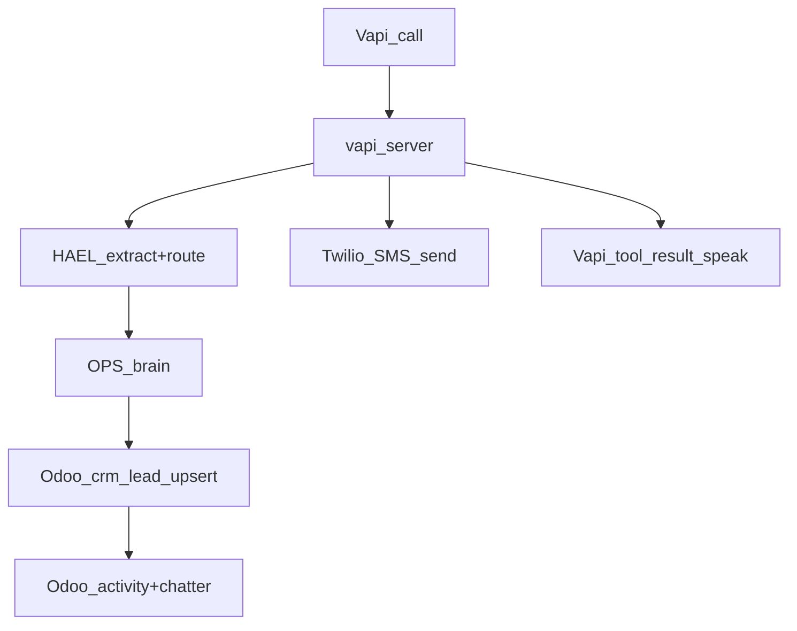

# Emergency flow: ETA + pricing + Odoo notifications + customer SMS

## Goals

- Make the Vapi voice flow reliably produce the outcomes in your checklist:
  - Emergency logic: “no heat” + indoor temp threshold <55°F → emergency
  - OPS assigns **Junior** for DeSoto (ZIP prefix 751xx)
  - Riley speaks an ETA window (1.5–3 hours) and computed emergency pricing
  - Odoo lead is created/updated with an **Emergency** tag and Odoo-native notifications recorded
  - Customer receives an SMS confirmation via Twilio

## Non-goals (for this iteration)

- Real calendar booking / route optimization / GPS-based ETA
- External staff notifications (SMS/email) — you chose **Odoo-only** for Dispatch/Linda/Tech

## Current state (what we’ll leverage)

- Emergency qualification rules already exist, including the 55°F threshold: `[src/brains/ops/emergency_rules.py](/Users/mac/Developer/HAES%20HVAC/src/brains/ops/emergency_rules.py)`
- Tech assignment by ZIP prefix exists: `[src/brains/ops/tech_roster.py](/Users/mac/Developer/HAES%20HVAC/src/brains/ops/tech_roster.py)`
- Pricing components exist and are explicitly defined: `[src/brains/core/pricing_catalog.py](/Users/mac/Developer/HAES%20HVAC/src/brains/core/pricing_catalog.py)` and computed via `calculate_service_pricing()` in `[src/brains/core/handlers.py](/Users/mac/Developer/HAES%20HVAC/src/brains/core/handlers.py)`
- Odoo lead upsert already works, including emergency banner in description: `[src/integrations/odoo_leads.py](/Users/mac/Developer/HAES%20HVAC/src/integrations/odoo_leads.py)`
- Vapi Server URL endpoint already orchestrates HAEL+brains and Odoo upserts: `[src/api/vapi_server.py](/Users/mac/Developer/HAES%20HVAC/src/api/vapi_server.py)`

## Proposed end-to-end flow

## Implementation plan

### 1) Update intake/tool parameters to carry system type + indoor temperature

- Update Vapi tool schema to include:
  - `system_type` (furnace/heat_pump/boiler/unknown)
  - `indoor_temperature_f` (integer)
- Update Vapi system prompt + KB policy so Riley:
  - When caller reports “no heat”: asks **indoor temperature**
  - If temp <55°F: confirms emergency and states dispatch ETA window
  - Captures `system_type` explicitly (quick question: “Is it a furnace or heat pump?”)

Files:

- `[doc/vapi/tool_schema.json](/Users/mac/Developer/HAES%20HVAC/doc/vapi/tool_schema.json)`
- `[doc/vapi/system_prompt.md](/Users/mac/Developer/HAES%20HVAC/doc/vapi/system_prompt.md)` (keep behavior/tone; move specifics to KB)
- `[doc/vapi/kb/ops_intake_and_call_policy.md](/Users/mac/Developer/HAES%20HVAC/doc/vapi/kb/ops_intake_and_call_policy.md)`

### 2) Make DeSoto (751xx) route to Junior

- Update `TECHNICIAN_ROSTER` so `junior.service_areas` includes `"751"`.
- (Optional but recommended) add a short comment documenting the business rule: “DeSoto zone = 751xx → Junior”.

File:

- `[src/brains/ops/tech_roster.py](/Users/mac/Developer/HAES%20HVAC/src/brains/ops/tech_roster.py)`

### 3) Add ETA window + CRITICAL wording to OPS results

- Extend OPS service-request result payload to include:
  - `priority_label`: `CRITICAL` when emergency
  - `eta_window_hours_min/max`: default `1.5` and `3.0` when emergency
  - `assigned_technician`: already present in `work_order`, but also surface in `data` for easier Vapi speak templating

File:

- `[src/brains/ops/handlers.py](/Users/mac/Developer/HAES%20HVAC/src/brains/ops/handlers.py)`

### 4) Compute emergency pricing from CORE catalog and include in speak + Odoo description

- In `vapi_server.execute_hael_route()` compute:
  - `is_after_hours` / `is_weekend` using `America/Chicago` and the same business-hour conventions
  - Use `calculate_service_pricing()` with default tier Retail unless we later add customer-tier lookups
- Include pricing breakdown in tool response `data` and a short, caller-friendly line in `speak`, e.g.:
  - “For emergencies, the base diagnostic today would be $X (includes after-hours/emergency premium). Final total depends on repair.”

Files:

- `[src/api/vapi_server.py](/Users/mac/Developer/HAES%20HVAC/src/api/vapi_server.py)`
- `[src/brains/core/handlers.py](/Users/mac/Developer/HAES%20HVAC/src/brains/core/handlers.py)` (reuse, not reimplement)

### 5) Odoo: apply “Emergency” tag + create Odoo-native notifications

**Emergency tag**

- Add support for `crm.lead.tag_ids` (if present) and ensure a `crm.tag` named `Emergency` exists (create if missing).

**Notifications (Odoo-only)**

- Create:
  - A chatter message on the lead that includes: emergency reason, assigned tech, ETA window, pricing breakdown
  - `mail.activity` assigned to:
    - Dispatch user ID
    - Linda user ID
    - Assigned tech user ID (we’ll add a field/mapping so “Junior” resolves)
- Add new settings for IDs (as you selected):
  - `ODOO_DISPATCH_USER_ID`
  - `ODOO_LINDA_USER_ID`
  - `ODOO_TECH_USER_IDS_JSON` (e.g. `{ "junior": 123, "bounthon": 456 }`)

Files:

- `[src/integrations/odoo_leads.py](/Users/mac/Developer/HAES%20HVAC/src/integrations/odoo_leads.py)` (tag + activity helpers)
- `[src/config/settings.py](/Users/mac/Developer/HAES%20HVAC/src/config/settings.py)` (new env vars)

### 6) Customer SMS confirmation via Twilio (no new dependency)

- Implement Twilio SMS sender using `httpx` (already a dependency) instead of adding the `twilio` SDK.
- Send in a FastAPI background task so Vapi tool-call response stays fast.
- SMS content (emergency example):
  - “HVAC-R Finest: Emergency request received. Tech Junior assigned. ETA 1.5–3 hours. Base diagnostic $X (premiums included). Reply STOP to opt out.”

Files:

- Add `[src/integrations/twilio_sms.py](/Users/mac/Developer/HAES%20HVAC/src/integrations/twilio_sms.py)`
- Update `[src/api/vapi_server.py](/Users/mac/Developer/HAES%20HVAC/src/api/vapi_server.py)` to enqueue background send
- Update `[src/config/settings.py](/Users/mac/Developer/HAES%20HVAC/src/config/settings.py)` to validate `TWILIO_ACCOUNT_SID`, `TWILIO_AUTH_TOKEN`, `TWILIO_PHONE_NUMBER`

### 7) Tests + verification checklist updates

- Unit tests (pytest):
  - Emergency qualification and threshold behavior:
    - “no heat” + `indoor_temperature_f=54` ⇒ emergency true
    - “no heat” + `indoor_temperature_f=56` ⇒ emergency false (unless other emergency keyword)
  - Pricing computation via CORE catalog:
    - Retail default tier
    - after-hours/weekend toggles
    - emergency premium + after-hours premium combined (should match catalog math)
  - Odoo lead updates (mock Odoo client):
    - Ensure `Emergency` tag is created/linked to the lead on emergency calls
    - Ensure chatter note is posted with: emergency reason, assigned tech, ETA, pricing
    - Ensure `mail.activity` is created for Dispatch/Linda/Tech using env-provided user IDs
  - Twilio SMS sender (mock `httpx`):
    - Correct Twilio REST endpoint, auth header, and message body
    - Handles non-2xx responses with a logged failure (and does not crash tool response)
- Integration tests (pytest hitting FastAPI test client):
  - POST a representative Vapi `tool-calls` payload to `/vapi/server`
  - Assert tool result includes:
    - `data.is_emergency == true`
    - `data.priority_label == "CRITICAL"`
    - `data.eta_window_hours_min == 1.5` and `data.eta_window_hours_max == 3.0`
    - `data.pricing.total_base_fee` present and consistent with premiums
    - `data.odoo.crm_lead_id` present (when Odoo enabled/mocked)

### 7b) Verification script (one-shot, end-to-end)

Add a script to validate the full emergency flow outside pytest, suitable for staging/prod smoke tests:

- New script: `scripts/verify_emergency_flow.py`
  - Sends a sample Vapi `tool-calls` request to the configured base URL (like other verify scripts)
  - Uses a deterministic “no heat” emergency payload including:
    - `issue_description="no heat"`
    - `indoor_temperature_f=54`
    - `address` in DeSoto, `zip_code`/address implying `75115`
    - `urgency="emergency"`
    - `system_type="furnace"` (or whatever we choose)
  - Asserts response includes:
    - emergency true + CRITICAL label
    - tech assignment resolves to Junior
    - pricing fields present
    - Odoo IDs present when Odoo is enabled
  - Twilio: supports a safe mode:
    - `TWILIO_DRY_RUN=true` skips real sending but verifies request build
    - `TWILIO_TEST_TO_NUMBER=...` can be used in staging to send to a test handset
  - Prints a concise PASS/FAIL report and exits non-zero on failure

Files:

- `[tests/test_vapi_tool_integration.py](/Users/mac/Developer/HAES%20HVAC/tests/test_vapi_tool_integration.py)`
- Add/extend focused tests as needed under `tests/`
- Add `[scripts/verify_emergency_flow.py](/Users/mac/Developer/HAES%20HVAC/scripts/verify_emergency_flow.py)`
- Update `[doc/vapi/VOICE_AGENT_VERIFICATION_CHECKLIST.md](/Users/mac/Developer/HAES%20HVAC/doc/vapi/VOICE_AGENT_VERIFICATION_CHECKLIST.md)` to reflect the now-implemented behaviors

### 8) Deploy + Vapi update steps

- Deploy backend changes and push updated Vapi tool config using the existing deploy process [[memory:13164995]].

## Acceptance criteria (maps to your checklist)

- Emergency logic:
  - “no heat” triggers temperature question; temp <55°F yields emergency classification
- Response UX:
  - Riley says “CRITICAL emergency” and the ETA window (1.5–3 hours)
  - Riley quotes pricing computed from catalog (Retail default), with a clear disclaimer
- OPS/tech:
  - DeSoto 75115 assigns Junior after roster update
- Odoo:
  - Lead created/updated, includes Emergency tag, includes assignment + pricing in chatter, and has activities assigned to Dispatch+Linda+Tech (IDs from env)
- SMS:
  - Customer receives Twilio SMS confirmation with assigned tech + ETA + pricing

## Rollout strategy

- Ship behind a feature flag (optional): `FEATURE_EMERGENCY_SMS=true` and `FEATURE_ODOO_ACTIVITIES=true`
- Start in staging / test assistant, then production

