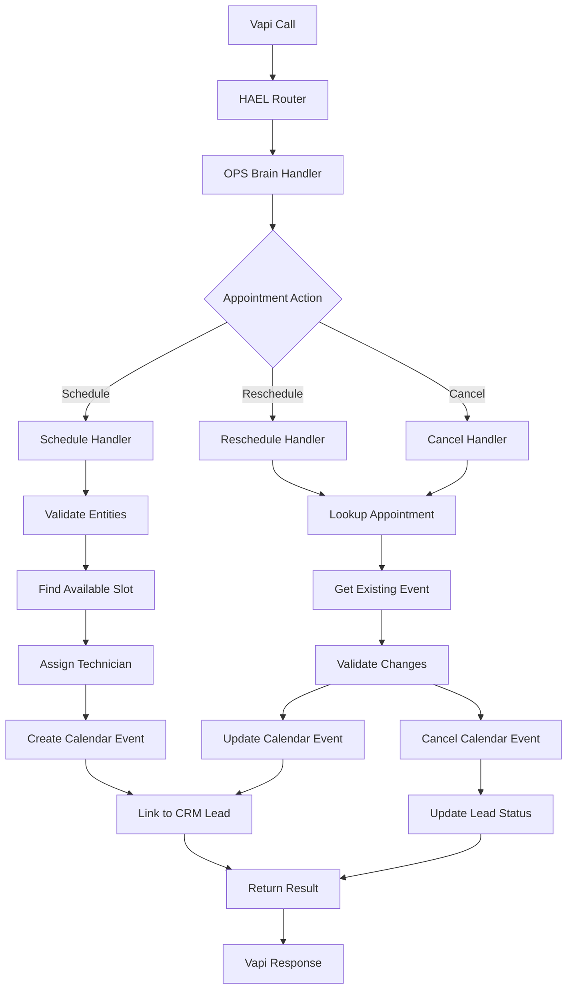
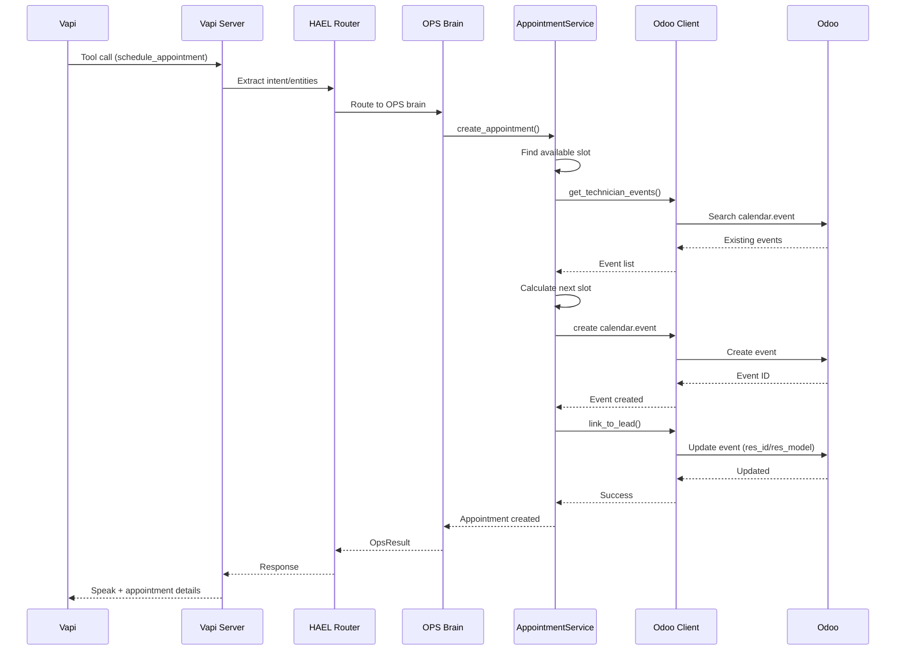

# Implement Full Appointment Scheduling with Odoo Integration

## Overview

Currently, appointment scheduling handlers exist but only return placeholder messages. This plan implements full Odoo integration to create, update, reschedule, and cancel appointments as calendar events, with proper technician assignment, scheduling rules, and CRM lead linking.

## Current State

**What exists:**

- Handler stubs in `src/brains/ops/handlers.py` (`_handle_schedule_appointment`, `_handle_reschedule_appointment`, `_handle_cancel_appointment`)
- Scheduling rules in `src/brains/ops/scheduling_rules.py` (business hours, time slots, travel time)
- Technician roster in `src/brains/ops/tech_roster.py`
- Odoo CRM lead integration pattern in `src/integrations/odoo_leads.py`
- Odoo client in `src/integrations/odoo.py`
- Odoo models available: `calendar.event`, `project.task`

**What's missing:**

- Odoo calendar event creation/update/cancel
- Appointment lookup by phone/email
- Integration of scheduling rules with Odoo
- Linking appointments to CRM leads
- Actual time slot selection and confirmation

## Architecture

## Implementation Plan

### Phase 1: Odoo Calendar Integration Module

**File: `src/integrations/odoo_appointments.py**` (new file)

Create a new module following the pattern of `odoo_leads.py`:

1. **AppointmentService class**
  - Initialize with `OdooClient`
  - Cache `calendar.event` fields
  - Safe field mapping with capability checking
2. **Core methods:**
  - `create_appointment()` - Create calendar event in Odoo
  - `find_appointment_by_contact()` - Lookup by phone/email
  - `update_appointment()` - Reschedule existing appointment
  - `cancel_appointment()` - Cancel appointment
  - `get_technician_calendar_events()` - Get existing appointments for tech
  - `link_appointment_to_lead()` - Link calendar event to CRM lead
3. **Field mapping:**
  - Map to `calendar.event` fields: `name`, `start`, `stop`, `partner_ids`, `user_id` (technician), `description`, `location`
  - Support `res_id`/`res_model` for linking to `crm.lead`
  - Handle timezone conversion (Odoo uses UTC)

### Phase 2: Update Scheduling Handlers

**File: `src/brains/ops/handlers.py**`

Update the three handler functions:

1. `**_handle_schedule_appointment()**`
  - Validate required fields (phone/email, service type, preferred time)
  - Use `scheduling_rules.py` to find available slot
  - Get existing appointments from Odoo via `AppointmentService`
  - Assign technician using `tech_roster.py`
  - Create calendar event in Odoo
  - Link to CRM lead if one exists
  - Return success with appointment details
2. `**_handle_reschedule_appointment()**`
  - Lookup existing appointment by phone/email
  - Validate new time slot using scheduling rules
  - Update calendar event in Odoo
  - Notify via email/SMS (if configured)
  - Return success with updated details
3. `**_handle_cancel_appointment()**`
  - Lookup existing appointment
  - Cancel calendar event (set active=False or delete)
  - Update linked CRM lead status if needed
  - Send cancellation confirmation
  - Return success

### Phase 3: Integrate Scheduling Rules with Odoo

**File: `src/integrations/odoo_appointments.py**`

Add helper methods:

1. `**get_technician_availability()**`
  - Fetch technician's calendar events from Odoo
  - Convert to `TimeSlot` objects for `scheduling_rules.py`
  - Filter by date range
2. `**find_next_available_slot()**`
  - Use `scheduling_rules.get_next_available_slot()`
  - Query Odoo for existing appointments
  - Return suggested time slots
3. `**validate_slot_availability()**`
  - Use `scheduling_rules.validate_scheduling_request()`
  - Cross-check with Odoo calendar events
  - Return validation result

### Phase 4: Link Appointments to CRM Leads

**File: `src/integrations/odoo_appointments.py**`

1. **Link creation:**
  - When creating appointment, link to existing `crm.lead` via `res_id`/`res_model`
  - Use `partner_id` from lead for customer link
  - Update lead stage if appropriate
2. **Lead lookup:**
  - Search for existing lead by phone/email
  - Create link in calendar event: `res_model='crm.lead'`, `res_id=<lead_id>`
  - This enables two-way navigation in Odoo

### Phase 5: Integrate with Vapi Server URL

**File: `src/api/vapi_server.py**`

Update `execute_hael_route()`:

1. **For schedule/reschedule/cancel intents:**
  - After OPS brain returns result, check if appointment was created
  - Extract appointment details from `OpsResult.data`
  - Include appointment info in response (time, technician, confirmation)
2. **Response format:**
  - Include `appointment_id` (Odoo calendar.event ID)
  - Include `scheduled_time` (ISO format)
  - Include `technician_name` if assigned
  - Update `speak` message with appointment confirmation

### Phase 6: Update Context and Tests

**Files:**

- `.cursor/context.json` - Update to reflect appointment scheduling implementation
- `tests/test_ops_handlers_comprehensive.py` - Add appointment scheduling tests
- `tests/test_vapi_tool_integration.py` - Add appointment scheduling integration tests

## Data Flow

## Key Design Decisions

1. **Use `calendar.event` not `project.task**`
  - Calendar events are simpler and better suited for appointments
  - Can link to leads via `res_id`/`res_model`
  - Standard Odoo calendar integration
2. **Idempotency via phone/email lookup**
  - Check for existing appointments before creating
  - Prevent duplicate appointments for same customer/time
3. **Scheduling rules integration**
  - Use existing `scheduling_rules.py` logic
  - Query Odoo for actual availability
  - Combine business rules with real data
4. **Technician assignment**
  - Reuse `tech_roster.py` assignment logic
  - Filter by service area and skill
  - Assign `user_id` in calendar event for Odoo user
5. **CRM Lead linking**
  - Always link appointments to leads when possible
  - Enables full workflow visibility in Odoo
  - Update lead stages appropriately

## Error Handling

- **No available slots**: Return `NEEDS_HUMAN` with suggested times
- **Odoo connection failure**: Fail-closed, return `NEEDS_HUMAN` with captured info
- **Missing required fields**: Return `NEEDS_HUMAN` with missing fields list
- **Appointment not found (reschedule/cancel)**: Return error, suggest creating new appointment

## Testing Strategy

1. **Unit tests:**
  - `AppointmentService` methods with mocked Odoo client
  - Scheduling rule integration
  - Field mapping validation
2. **Integration tests:**
  - End-to-end appointment creation via Vapi
  - Reschedule/cancel flows
  - CRM lead linking
  - Technician assignment logic
3. **Edge cases:**
  - No available technicians
  - All slots booked
  - Timezone handling
  - Weekend/holiday scheduling

## Configuration

No new environment variables needed. Uses existing:

- `ODOO_BASE_URL`, `ODOO_DB`, `ODOO_USERNAME`, `ODOO_PASSWORD`
- `ODOO_DISPATCH_USER_ID` (for appointment assignments)

## Dependencies

- Existing: `odoo.py`, `scheduling_rules.py`, `tech_roster.py`, `odoo_leads.py`
- New: `odoo_appointments.py`

## Success Criteria

1. Appointments created in Odoo as calendar events
2. Appointments linked to CRM leads
3. Technician assignment working
4. Reschedule/cancel operations functional
5. Scheduling rules respected (business hours, buffers, etc.)
6. Integration with Vapi Server URL working
7. Tests passing

## Files to Create/Modify

**New files:**

- `src/integrations/odoo_appointments.py` (~400-500 lines)

**Modified files:**

- `src/brains/ops/handlers.py` (~150 lines changed)
- `src/integrations/__init__.py` (export `odoo_appointments`)
- `src/api/vapi_server.py` (~50 lines for appointment handling)
- `tests/test_ops_handlers_comprehensive.py` (~100 lines new tests)
- `tests/test_vapi_tool_integration.py` (~50 lines appointment tests)
- `.cursor/context.json` (update status)

## Implementation Order

1. Create `odoo_appointments.py` module with basic structure
2. Implement `create_appointment()` method
3. Implement appointment lookup methods
4. Update `_handle_schedule_appointment()` to use Odoo
5. Implement `update_appointment()` and update reschedule handler
6. Implement `cancel_appointment()` and update cancel handler
7. Add scheduling rules integration
8. Add CRM lead linking
9. Integrate with Vapi Server URL
10. Add tests
11. Update context.json

