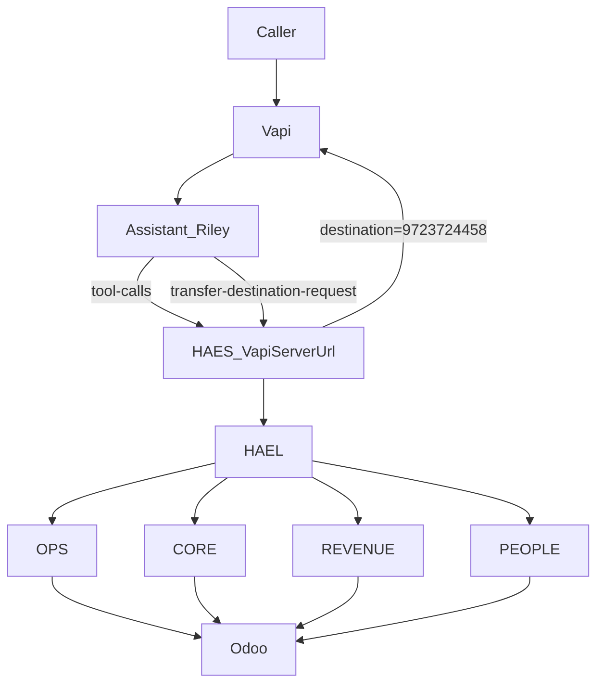

# Vapi Full Setup Plan (HAES HVAC)

## Scope

This plan completes the **Vapi-side “brains + KB + tools + handoff” setup** so inbound calls can reliably flow:

- **Call** → Vapi Assistant → **Vapi Server URL** (`tool-calls`) → HAES (`HAEL → brain → Odoo`) → Vapi speaks next step
- If HAES returns `needs_human`: **transfer during business hours (8am–5pm America/Chicago) to 972-372-4458**, otherwise collect details + create Odoo record + promise callback.

This plan is consistent with:

- Requirements in [`doc/Requirements.md`](/Users/mac/Developer/HAES%20HVAC/doc/Requirements.md)
- Current system wiring in [`.cursor/context.json`](/Users/mac/Developer/HAES%20HVAC/.cursor/context.json)
- Discovered available Odoo models in [`.cursor/odoo_discovery.json`](/Users/mac/Developer/HAES%20HVAC/.cursor/odoo_discovery.json)
- Business rules + voice constraints in [`doc/HAES - Requirement Discovery Document.md`](/Users/mac/Developer/HAES%20HVAC/doc/HAES%20-%20Requirement%20Discovery%20Document.md)
- The modular monolith plan in [`.cursor/plans/haes_modular_monolith_2538f8dc.plan.md`](/Users/mac/Developer/HAES%20HVAC/.cursor/plans/haes_modular_monolith_2538f8dc.plan.md)

## Key decision (locked)

- **Vapi call-to-HAES integration mode**: Use **Vapi Server URL (`tool-calls`)** (selected).
- **Human handoff**: **transfer during business hours** to **972-372-4458**, otherwise callback intake (selected).

## Architecture update

We will move from “custom schema tool endpoint” to the **Vapi-native Server URL contract**.

## Phase 1 — Define Vapi assistant behavior (System Prompt + policy)

### 1.1 Assistant personality + non-negotiables (from RDD)

Create a **system prompt** that hard-codes:

- **Tone**: professional, friendly, caring, balanced pacing.
- **Prohibited phrases**: the exact list in RDD (no promises/guarantees/free/etc.).
- **Fail-closed policy**: if missing required info, ask follow-up questions; don’t guess.
- **Weekend handling**: “weekends booked out” rule and after-hours messaging.
- **Emergency behavior**: treat gas leak/CO/electrical burning smell/water leak as emergency; for “no AC/no heat” treat as emergency only if caller explicitly states temperature thresholds (85F/55F) or emergency phrasing.

Deliverable:

- A versioned prompt document in repo: [`doc/vapi/system_prompt.md`](/Users/mac/Developer/HAES%20HVAC/doc/vapi/system_prompt.md) (no secrets).

### 1.2 Conversation policy: what to ask before calling tools

Encode the intake checklists (derived from RDD 9.3):

- **Service requests / scheduling**: name, phone/email, address/zip, problem description, urgency, preferred time windows, gate/access code, pets, occupied/unoccupied, after-hours authorization, PM company.
- **Quote requests**: property type, sq ft, system age, budget range, timeline, gas/electric, number of systems, ductwork known/unknown, financing yes/no, HOA yes/no, ceiling height, photos available.
- **Billing/status**: identity + invoice number (or lookup by email/phone if allowed).

Rule: the assistant asks for missing fields **only when needed** (to reduce call time), then calls the tool.

### 1.3 Human handoff policy

Assistant behavior when HAES returns `needs_human`:

- First try to collect the missing fields once.
- If still `needs_human` or caller asks for a human:
  - During **8am–5pm America/Chicago**: initiate transfer.
  - Otherwise: collect callback info + summarize issue + tell caller when they’ll be contacted.

## Phase 2 — Tooling design in Vapi (minimal, reliable)

We keep **one primary tool** and use **Vapi Server URL**.

### 2.1 Tool: `hael_route`

Define a Vapi function tool:

- **name**: `hael_route`
- **parameters**:
  - `user_text` (string, required)
  - `conversation_context` (string, optional)
  - `channel` (string, optional; always `voice`)

Expected semantics:

- The assistant sends the latest caller request and any brief context.
- HAES returns structured result + next message.

### 2.2 Optional tool (only if needed later)

Defer adding more tools (calendar lookup, invoice lookup, etc.) because HAES already routes via HAEL/brains. Add more tools only when a single-tool approach causes repeated failures.

## Phase 3 — Backend: implement Vapi Server URL endpoint (tool-calls + transfer)

### 3.1 New endpoint: `POST /vapi/server`

Add a Vapi Server URL handler that:

- Verifies signature with `VAPI_WEBHOOK_SECRET` (already supported in [`src/utils/webhook_verify.py`](/Users/mac/Developer/HAES%20HVAC/src/utils/webhook_verify.py)).
- Supports these `message.type` values:
  - **`tool-calls`**: execute `hael_route` and return **Vapi-compliant response**:
    - `{ "results": [{"toolCallId": "...", "result": "<json-string>"}], "speak": "..." }`
  - **`transfer-destination-request`** (or handoff equivalent): return destination based on business hours.
  - **`end-of-call-report` / transcript events** (optional): log to `audit_log` for KPI/reporting.

Files to add/change:

- Add: [`src/api/vapi_server.py`](/Users/mac/Developer/HAES%20HVAC/src/api/vapi_server.py)
- Update router exports: [`src/api/__init__.py`](/Users/mac/Developer/HAES%20HVAC/src/api/__init__.py)
- Include router: [`src/main.py`](/Users/mac/Developer/HAES%20HVAC/src/main.py)

### 3.2 Reuse HAES pipeline from existing tool route

Inside the new server endpoint:

- Parse tool calls and map `user_text` → existing HAEL pipeline (same code-path as [`src/api/vapi_tools.py`](/Users/mac/Developer/HAES%20HVAC/src/api/vapi_tools.py)).
- Convert current `VapiToolResponse` shape into Vapi Server URL shape.
- Preserve idempotency:
  - Use the Vapi `toolCallId` (or call id + toolCallId) as the idempotency key scope.

### 3.3 Transfer destination logic

Implement deterministic “business hours transfer”:

- Timezone: **America/Chicago**
- Window: **08:00–17:00**
- Destination number: **972-372-4458**
- Outside window: return destination as “no transfer” with a message (Vapi schema), and HAES tool flow will instead create callback tasks/leads.

### 3.4 Update/keep existing endpoints

- Keep existing [`src/api/vapi_tools.py`](/Users/mac/Developer/HAES%20HVAC/src/api/vapi_tools.py) for internal testing (FastAPI tests already exist), but production Vapi will use `/vapi/server`.
- Keep [`src/webhooks/vapi.py`](/Users/mac/Developer/HAES%20HVAC/src/webhooks/vapi.py) or make it forward to the new server handler (optional). The authoritative integration becomes `/vapi/server`.

## Phase 4 — Vapi platform configuration (Dashboard/API)

### 4.1 Assistant configuration

Update assistant “Riley”:

- **System prompt**: paste from `doc/vapi/system_prompt.md`
- **server.url**: `https://haes-hvac.fly.dev/vapi/server`
- **serverUrlSecret**: set to same value as HAES `VAPI_WEBHOOK_SECRET`
- **serverMessages**: enable at least:
  - `tool-calls`
  - `transfer-destination-request`
  - `end-of-call-report`
  - `status-update`

### 4.2 Tools

- Create/update Vapi tool `hael_route`.
- Attach tool to assistant model toolIds.

### 4.3 Phone number

- Ensure the Vapi-Twilio phone number is routed to assistant “Riley”.
- Confirm inbound call handling:
  - Answer after 2 rings (RDD)
  - After-hours: AI handles all calls

## Phase 5 — Knowledge Base (KB) setup

### 5.1 What goes into KB (non-sensitive)

Create a curated KB pack (documents) derived from `doc/Requirements.md` and RDD sections:

- Company/service area summary
- Business hours policy (including “weekends booked out”)
- Emergency definitions
- Payment terms summary
- Disclosures + warranty terms (license disclosure text)
- “What we can and cannot say” (prohibited phrases)

Deliverables:

- [`doc/vapi/kb/customer_faq.md`](/Users/mac/Developer/HAES%20HVAC/doc/vapi/kb/customer_faq.md)
- [`doc/vapi/kb/policies.md`](/Users/mac/Developer/HAES%20HVAC/doc/vapi/kb/policies.md)

### 5.2 Where KB lives

Use Vapi’s built-in Knowledge Base upload (recommended) so the assistant can answer FAQs without hitting tools, but:

- Anything operational (scheduling, creating records, quotes) must still go through `hael_route`.

## Phase 6 — Verification (deterministic, no hallucination)

### 6.1 Local/unit tests

Add tests for the new `/vapi/server` endpoint:

- Tool-calls request parsing
- Correct response shape (`results` array + toolCallId passthrough)
- Signature verification required in production

Files:

- Add: [`tests/test_vapi_server_url.py`](/Users/mac/Developer/HAES%20HVAC/tests/test_vapi_server_url.py)
- Add: [`scripts/verify_vapi_server_url.py`](/Users/mac/Developer/HAES%20HVAC/scripts/verify_vapi_server_url.py) (sends sample `tool-calls` payload and checks response)

### 6.2 Production smoke tests

- `POST https://haes-hvac.fly.dev/vapi/server` with a signed `tool-calls` payload → 200 with valid `results`.
- Transfer test:
  - simulate `transfer-destination-request` at business hours → destination=972-372-4458
  - simulate outside hours → no transfer + callback message

### 6.3 End-to-end call test

Test flows:

- **Service request** (emergency phrasing) → OPS brain → Odoo (res.partner + calendar.event/project.task depending on implementation) → assistant speaks confirmation.
- **Quote request** → REVENUE brain → Odoo (crm.lead) → follow-up activities (mail.activity) if available.
- **Billing inquiry** → CORE brain → Odoo read.

Observability checks:

- `audit_log` entries created with correlation ids
- no secrets logged

## Phase 7 — Documentation + context update

- Update [`doc/DEPLOYMENT.md`](/Users/mac/Developer/HAES%20HVAC/doc/DEPLOYMENT.md) with:
  - Vapi Server URL endpoint
  - how to set `VAPI_WEBHOOK_SECRET`
  - how to update assistant config
- Update [`.cursor/context.json`](/Users/mac/Developer/HAES%20HVAC/.cursor/context.json) to reflect:
  - new endpoint `/vapi/server`
  - Vapi integration mode = Server URL tool-calls
  - handoff policy (business hours transfer)

## Rollout checklist

- Confirm `VAPI_WEBHOOK_SECRET` set in Fly secrets
- Confirm assistant serverUrl points to `/vapi/server`
- Confirm `hael_route` tool exists and attached
- Confirm test inbound call completes and creates correct Odoo artifacts
- Confirm signature enforcement works